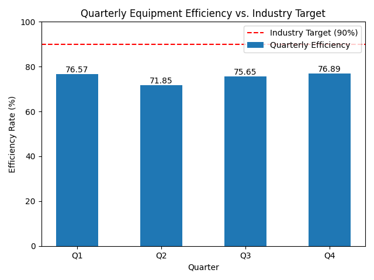

# Manufacturing Performance Analysis: Equipment Efficiency

## Overview

This analysis examines the quarterly equipment efficiency rate for 2024 to understand and address the recent decline in performance. The findings will inform strategic decisions for the upcoming fiscal year.

## Data Visualization

## Key Findings

- **Average Efficiency:** The average equipment efficiency rate for 2024 is **75.24%**, which is significantly below the industry benchmark of 90%.
- **Quarterly Performance:** The efficiency rates for 2024 are as follows:
    - Q1: 76.57%
    - Q2: 71.85%
    - Q3: 75.65%
    - Q4: 76.89%
- **Performance Gap:** There is a persistent gap of approximately 15 percentage points between our performance and the industry target.

## Business Implications

The current trend of low equipment efficiency has several negative impacts on the business:

- **Increased Downtime:** Lower efficiency correlates with higher equipment downtime, leading to production delays and loss of revenue.
- **Rising Maintenance Costs:** Reactive maintenance is more expensive than proactive, and the current trend suggests an increase in these costs.
- **Competitive Disadvantage:** Falling short of the industry benchmark indicates a competitive disadvantage that could impact market share and profitability.

## Recommendations

To address the performance gap and achieve the 90% efficiency target, the following actions are recommended:

1.  **Implement a Predictive Maintenance Program:** Transition from a reactive to a predictive maintenance model. By using data and analytics to predict when equipment will fail, we can schedule maintenance proactively, reducing downtime and extending equipment life.
2.  **Invest in Sensor Technology:** Equip critical machinery with sensors to gather real-time performance data, which is essential for a successful predictive maintenance program.
3.  **Employee Training:** Train maintenance and operations teams on the new systems and the principles of predictive maintenance.

## Contact

For further details, please contact:

- **Email:** 23f2000764@ds.study.iitm.ac.in
